# Hello-Spring !

<[스프링 입문 - 코드로 배우는 스프링 부트, 웹 MVC, DB 접근 기술](https://www.inflearn.com/course/%EC%8A%A4%ED%94%84%EB%A7%81-%EC%9E%85%EB%AC%B8-%EC%8A%A4%ED%94%84%EB%A7%81%EB%B6%80%ED%8A%B8/dashboard)>

Inflearn 강의를 보며 스프링에 입문해 공부하면서 진행한, 회원관리 예제 프로젝트 입니다.

모든 내용과 그림 자료들은 수업 자료에서 근거하였습니다.

<br/>

* [새로 배운 IntelliJ 단축키](./IntelliJ_short_key.md)
* [어노테이션](./Annotation.md)

<br/>

<br/>

## 라이브러리 살펴보기

> Gradle은 의존관계가 있는 라이브러리를 함께 다운로드 한다.

<br/>

### Spring boot 라이브러리

* spring-boot-starter-web
  * spring-boot-starter-tomcat: 톰캣 (웹서버)
  * spring-webmvc: 스프링 웹 MVC
* spring-boot-starter-thymeleaf: 타임리프 템플릿 엔진(View)
* spring-boot-starter(공통): 스프링 부트 + 스프링 코어 + 로깅
  * spring-boot
    * spring-core
  * spring-boot-starter-logging
    * logback, slf4j

<br/>

### Test 라이브러리

* spring-boot-starter-test
  * junit: 테스트 프레임워크
  * mockito: 목 라이브러리
  * assertj: 테스트 코드를 좀 더 편하게 작성하게 도와주는 라이브러리
  * spring-test: 스프링 통합 테스트 지원

<br/>

### Maven, gradle

* 필요한 라이브러리를 가져오고, 빌드하는 라이프 사이클까지 관리해주는 툴
* 과거에는 메이븐을 많이 썼지만 요즘엔 그래들을 많이 사용한다.
* 의존 관계를 다 관리해준다.
  * 필요한 라이브러리를 우리가 추가할 수 있는데, 그 외의 라이브러리도 추가된다.
  * 의존 관계가 있는 모든 라이브러리를 알아서 다 다운로드 해온다.
* [Maven, gradle 차이](https://github.com/Sanggoe/development-about-java/blob/main/Maven_Gradle.md)

<br/>

### Logging

* 실무에서는 System.out.println() 은 전혀 수준으로 거의 쓰지 않는다.
* 대신 logging을 이용해 로그를 남기는 방법을 사용한다.
* 추후에 로그의 오류 수준에 따라 모아서 볼 수 있는 등의 작업 수행을 위해서 그렇게 한다.
* slf4j + logback의 조합을 주로 사용한다고 한다.
* [Logging 모듈](https://github.com/Sanggoe/development-about-java/blob/main/log4j.md)

<br/>

### Junit

* 테스트 프레임워크
* 자바 진영에서는 테스트 할 때 해당 라이브러리를 많이 쓴다.
* 그래서 스프링에서도 이걸 많이 쓰고, 최근들어 버전 5로 넘어가는 추세!

<br/>

<br/>                                                                                                                                                                                                                                                                                                                                                                                                                                                                                                                                                                                                                                                                                                                                                                                                                                                                                                                                                                                                                                                                                                                                                                                                                                                                                                                                                                                                                                                                                                                                                                                                                                                                                                                                                                                                                                                                                                                                                                                                                                                                                                                                                                                                                                                                                                                                                                                                                                                                                                                                                                                       

## View 환경설정

> 스프링 부트에서는 static/index.html을 올려두면 Welcom page 기능을 제공한다.

* static에 파일이 없으면 다음은 templates 폴더에서 찾는다.

<br/>

<br/>

## 스프링 웹 개발 기초

<br/>

> * 정적 컨텐츠 : html 파일 그대로 웹 브라우저에 전달해주는 방식
> * MVC와 템플릿 엔진 : 서버에서 변형해서 전달해주는 방식
> * API : Json이라는 데이터 구조 포멧으로 클라이언트에게 데이터를 전달해주는 방식

<br/>

### 내부 구동 방법

* Controller
* Repository
* Member
* Service

<br/>

#### 동작 환경

* 웹 브라우저가 요청을 하면, 자체적으로 내장하고 있는 톰켓 서버가 받아서 넘겨준다.
* 스프링 컨테이너에서는 우선적으로 컨트롤러를 찾는다.
  * 컨트롤러에 GetMapping 된 hello URL에 매칭되어 해당 메소드가 실행된다.
  * 매개변수는 스프링이 Model로 만들어서 넘겨준다.
* 컨트롤러에서 리턴 값으로 hello를 반환하면 viewResolver가 화면을 찾아서 처리한다.
  * 스프링 부트 템플릿엔진 기본 viewName 매핑
  * resources:templates/ + {ViewName} + .html
    * 쉽게 말해, templates 폴더 아래에 있는 반환된 ViewName.html 파일이 열린다.

<br/>

* Controller라는 어노테이션이 있으면, 스프링이 뜰 때 객체를 생성해서 관리한다.
* 이를 Bean을 관리한다고 표현하는데, 콩 처럼 생겨서...

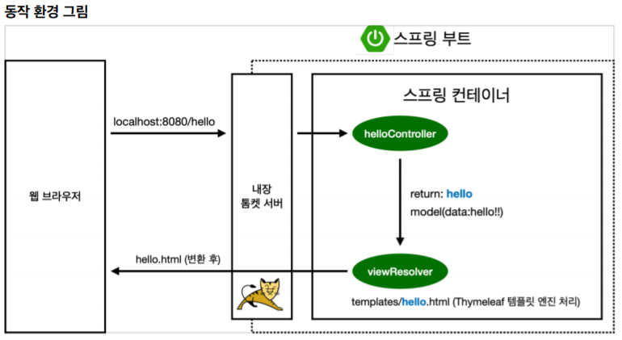

<br/>

#### 정적 컨텐츠 이미지

> 요청한 경로에 해당하는 html 파일을 그대로 직접 반환하는 방식

<br/>

* 웹 브라우저가 localhost:8080/hello.static.html을 달라고 요청을 한다.
* 그럼 스프링은 우선적으로 컨트롤러가 있는지 찾는다.
* 만약 매칭되는 컨트롤러가 없으면 내부에 resources - static 위치에 요청한 이름의 html 파일이 있는지 찾아 직접 그 페이지를 반환한다.
* 이 html 페이지는 정적 컨텐츠이며, 기본 경로로 **/static** 또는 **/public**, **/resources** 등을 우선적으로 찾는다.
* [스프링 부트 정적 컨텐츠 기능](https://docs.spring.io/spring-boot/docs/2.3.1.RELEASE/reference/html/spring-boot-features.html#boot-features-spring-mvc-static-content) - spring.io reference

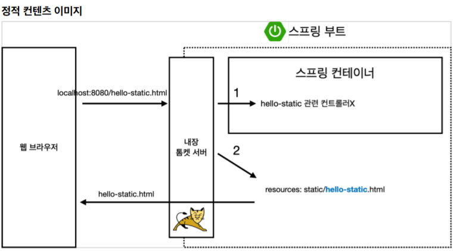

<br/>

#### MVC, 템플릿 엔진

> 넘겨준 데이터를 토대로 템플릿을 이용해 렌더링 한 html 파일을 반환하는 방식이다.

<br/>

* 웹 브라우저에서 localhost:8080/hello-mvc?name=spring 를 넘기면, 내장 톰켓 서버를 거친다.
  * get 방식으로 위와 같이 key는 name, value는 "spring" 으로 호출한다. 
  * 스프링은 이 값들을 모델로 넣어 전달한다.
* 톰켓 서버는 이 요청이 왔다고 스프링에게 던진다.
* 그럼 스프링은 helloController라는 컨트롤러에 매핑된 메소드를 호출해준다.
* return 값으로 hello-template을 반환하기 전에, model의 값을 스프링에게 전달한다.
* 이 때 스프링은 **viewResolver**에게 전달해서 해당 요청 파일을 **/templates** 경로에서 찾아 템플릿 엔진에게 처리해달라고 넘긴다.
* 그러면 Thymeleaf 템플릿 엔진은 렌더링을 해서 **변환한 html을** 웹 브라우저에게 반환한다.

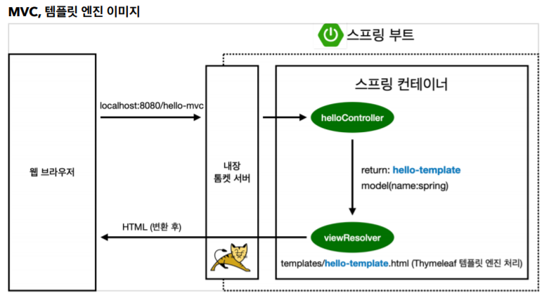

<br/>

#### API 방식 - @ResponseBody

> Http의 head와 body중, body 부분의 내용을 직접 넣어주는 방식이다.

* 이 방식은, HTTP의 BODY에 문자 내용을 직접 반환한다. (HTML BODY TAG를 말하는 것이 아님)
* 따라서 "\<HTML> .. " 등 html 태그를 모두 문자열로 반환해서 출력할 수도 있지만, 굳이...

<br/>

* **@ResponseBody**를 사용하면 viewResolver를 사용하지 않는다.
* 대신에 **HttpMessageConverter** 가 동작한다.
* 반환하는 내용이 객체이면 **Json** 형식, 문자열이면 **String** 형식으로 컨버터를 호출해 처리한다.
  * 기본 **문자**처리 : **String**HttpMessageConverter
  * 기본 **객체**처리: Mapping**Jackson**2HttpMessageConverter
  * (byte 처리 등등 기타 여러 HttpMessageConverter가 기본으로 등록되어 있음)

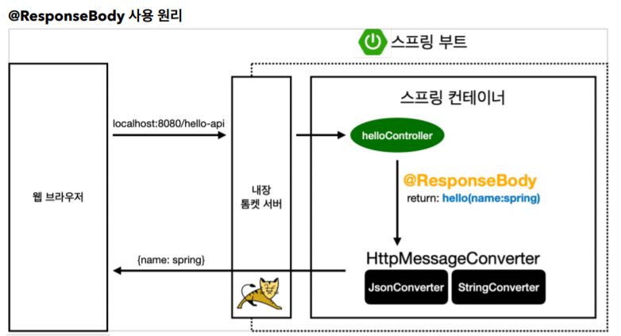

<br/>

### 개발 방식 참고

* Java Bean 표준 방식
* Property 접근 방식

<br/>

<br/>

## 회원 관리 예제 - 백엔드 개발

<br/>

### Optional\<T\>

* Java 8에 들어간 기능
* 메소드를 호출해 반환하는 값이 NULL 인 경우가 생길 수 있다.
* NULL 값인 경우에 대해 예외적으로 처리하는 것 역시 개발에서 중요한 이슈 중 하나!
* 요즘에는 그 NULL 값을 그대로 반환하는 대신에 이 Optional로 감싸서 반환하는 방법을 선호한다.
* [Optional 이란?](./Optional.md)

<br/>

<br/>

### Test case 작성

* 개발한 기능을 테스트 해볼 때 사용한다.
* main메소드나 controller 등을 통해 실행하는 방법은 오래걸리고, 반복 실행이 어렵다.
* 따라서 자바에서 JUnit 이라는 프레임 워크를 통해 테스트를 실행해 문제를 해결한다.
* 테스트 코드에서는 메소드 이름을 한글로 적어도 된다!!

<br/>

#### 사용 방법

* 테스트 하려는 파일과 **같은 패키지 경로**, **같은 클래스 이름+Test**를 만드는 것이 관례이다.
* 테스트 메소드 위에 @Test 어노테이션을 써준다.

<br/>

#### 더 편한 Test 방법!!

* 테스트 하려는 클래스의 이름에 가서 ctrl + shift + t 를 눌러 Create New Test 를 해주면 껍데기를 만들어준다.

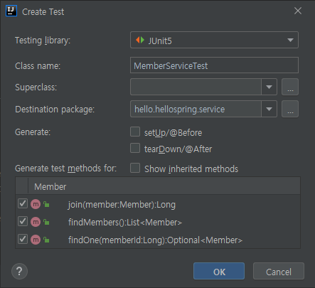

<br/>

#### Given / when / then 패턴

* given
  * 이 데이터를 기반으로 하는구나!
  * 검증할 데이터에 대해 주어지는 부분
* when
  * 이걸 검증하는구나!
  * 뭘 검증할 것인지를 작성하는 부분
* then
  * 여기가 검증부 구나!

<br/>

#### import org.junit.jupiter.api.Assertions;

* Assertions.assertEquals(expected, actual);
  * 테스트 케이스로 두 번째 인자가 첫 인자값과 같은지 비교하기 위해 사용하는 방법 중 하나.

<br/>

#### import org.assertj.core.api.Assertions;

* Assertions.assertThat(expected).isEqualTo(actual);
  * 마찬가지로 뒤의 인자가 앞선 인자와 같은지 비교하기 위해 사용하는 방법
  * Static으로 import 하여 Assertions 없이 바로 assertThat 을 사용할 수 있다.

<br/>

#### try-catch

* 예외 처리에 대한 상황을 처리하기 위해 try-catch를 사용하기도 한다.
* 하지만 그보다 더 좋은 문법을 제공한다.  

<br/>

#### assertThrows

* assertThrows(IllegalStateException.class, () -> memberService.join(member2))
  * 해당 객체의 메소드를 실행했을 때 발생하는 예외를 반환한다.
  * 반환한 값을 예외클래스 객체 e로 받아, getMessage()가 같은지 비교하는 형식으로도 쓸 수 있다.
  * 

<br/>

#### 주의할 점 

* 테스트는 순서가 보장되지 않기 때문에, 서로 의존관계 없이 독립적으로 테스트 되도록 설계되어야 한다!!
* 그러기 위해선 각 테스트가 종료될 때마다 저장소나 공용 데이터를 지워주어야 문제가 발생하지 않는다.
  * @AfterEach 어노테이션을 붙여주면, 각 메소드가 수행된 후마다 callback 함수처럼 호출된다.
  * 해당 클래스에 객체.clear() 라는 저장소를 비우는 기능을 수행하는 메소드를 만들어 호출한다.
* 테스트는 잘 작동되는지 확인하는 것도 중요하지만, 예외 상황을 잘 처리하는지 테스트도 중요하다.

<br/>

<br/>

#### 테스트 주도 개발, TDD

* TDD : Test-driven development

* 테스트를 먼저 만들고 구현 클래스를 만들어서 돌려보는 방식을 말한다.
* [참고 블로그](https://medium.com/@jang.wangsu/tdd-tdd%EC%9D%98-%EC%9E%A5%EB%8B%A8%EC%A0%90%EC%97%90-%EB%8C%80%ED%95%B4-%EC%83%9D%EA%B0%81%ED%95%B4%EB%B3%B4%EA%B8%B0-dcf32a72b098)

<br/>

<br/>

### 서비스

* 서비스는 비즈니스 의존적으로 단어 등을 사용하며 설계하고,

* 리포지토리는 단순히 기계적으로, 개발스럽게 단어를 선택한다.

<br/>

<br/>

## 스프링 빈과 의존관계

<br/>

### 스프링 환경에 대해 다시 짚고 넘어가자!


* 스프링 부트 안에 스프링 컨테이너가 있다.
* 그 안에 보면 helloController 라는 것이 바로 콩처럼 생긴 Bean...
* 컨트롤러라는 Annotation이 있으면 스프링이 뜰 때 객체를 생성해서 스프링이 관리를 해준다.
* 그 덕분에 스프링과 관련된 기능들이 동작할 수 있게 되는 것!

<br/>

#### Dependency Injection, 의존성 주입

> 객체를 new 생성자로 직접 넣어주는 것이 아니라, 외부에서 매개변수로 받아와 넣어주는 방법

* 회원 controller가 회원 service와 회원 repository를 사용할 수 있게 의존 관계를 추가한다.
* **생성자에 @Autowired가 있으면 스프링이 연관된 객체를 스프링 컨테이너에서 찾아 넣어준다.**
* 이렇게 객체의 의존관계를 외부에서 넣어주는 것을 의존성 주입이라고 한다.

<br/>

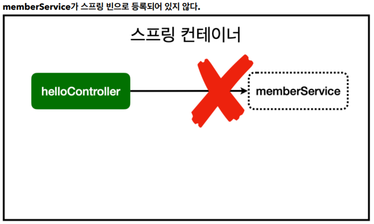

* 하지만 @Autowired만 해주면 등록된 스프링 빈을 찾을 수 없다는 에러가 뜰 것이다.
* 이를 위해 스프링 빈으로 등록해주어야 한다.
  * Bean이 되는 클래스에 **생성자가 하나만 있고**, 생성자의 **매개변수 Type이 빈으로 등록되어 있다면** @Autowired가 없더라도 그 **Bean을 주입해준다.**
  * 즉, @Autowired 생략 가능

<br/>

### 1. Component Scan과 자동 의존관계 설정

> 스프링 빈을 등록하는 첫 번째 방법
>
> Component scanning을 이용해 @component 어노테이션들을 모두 인식해 스프링이 자동으로 등록

<br/>

* **@Component** 어노테이션이 있는 것은 전부 객체를 생성해서 **스프링 빈으로 자동으로 등록**한다.
  * 다음 어노테이션들도 내부에 @Component 를 포함하는 어노테이션이다.
  * **컴포넌트 스캔** 때문에 자동으로 스프링 빈으로 등록되는 것이다.
    * @Controller
    * @Service
    * @Repository

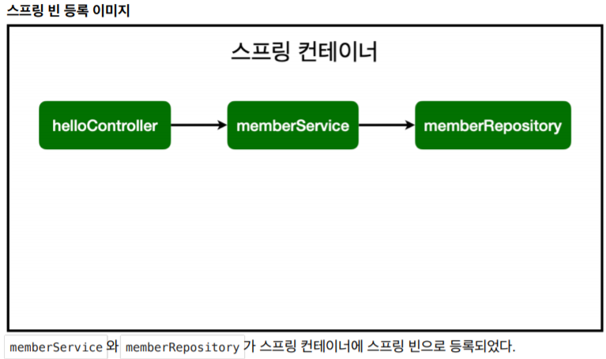

* 그리고 @Autowired는 해당 연관 관계 즉, 선을 그어주는 녀석이라고 생각하면 된다.

<br/>

#### 주의할 점!

* **@SpringBootApplication이 존재하는 패키지의 하위 경로에만 자동 등록이 가능하다.**
* **그리고, 기본적으로 싱글톤으로 등록한다. 따라서 같은 스프링 빈이면 같은 인스턴스다.**
* 특별한 경우가 아니면 대부분은 싱글톤!

<br/>

### 2. 자바 코드로 직접 스프링 빈 등록하기

> 스프링 빈을 등록하는 두 번째 방법
>
> 직접 @Configuration 설정 파일에 적어서 빈 등록

<br/>

* 컴포넌트 스캔으로 자동 등록하는 방법이 아니라, 직접 등록하는 방법이다.
* SpringConfig라는 자바 파일을 만들고, 클래스 상단에 @Configuration 어노테이션을 붙인다.
* @Bean 어노테이션을 생성자에 붙이면 스프링이 인식해서 빈으로 등록해준다.
* 생성자의 반환값으로 new 생성자로 해당 객체를 반환하도록 한다.
* 이 때 의존성을 가지는 다른 객체를 생성자 매개변수 인자로 넣어줄 수 있다.
* Config 파일을 만들어 @Bean으로 직접 등록하면, 다른 코드 영향 없이 구현 클래스를 손쉽게 교체할 수 있다.

<br/>

### TIP!

#### DI의 3가지 방법

* 생성자(Constructor) 주입
  * 의존관계가 실행 중 동적으로 변하는 경우는 없기 때문에 이 방법을 권장한다.
* 필드(Field) 주입
  * 중간에 값을 변경할 방법이 없어 별로 권장하지 않는다.
* setter 주입
  * setter 메소드가 public으로 열려 있어야 하고, 중간에 바꿀 수 없다.
  * 누구나 호출할 수 있는 메소드이기에, 별로 권장하지 않는다.

<br/>

* **컴포넌트 스캔을 사용하는 경우**
* 실무에서는 주로 정형화된 컨트롤러, 서비스, 리포지토리 같은 코드는 컴포넌트 스캔을 사용한다.
  
* **직접 자바코드로 스프링 빈을 등록하는 경우**

  * 정형화 되지 않거나, 상황에 따라 구현 클래스를 변경해야 하면 설정을 통해 스프링 빈으로 등록한다

  * 위 예제의 경우에 해당하는데,  DB가 선택되지 않아서 나중에 교체하려는 시나리오로 진행한다.

* **스프링 빈에 등록하지 않은 객체의 경우**
* **@Autowired 를 통한 DI는, 스프링이 관리하는 객체에서만 동작한다.**
  * 즉, 스프링 컨테이너에 빈으로 등록된 객체에 대해서만 동작한다.
  * 스프링 빈으로 등록하지 않고 내가 직접 생성한 객체에서는 동작하지 않는다.

<br/>

<br/>

## 회원 관리 예제 - 웹 MVC 개발

<br/>

#### 웹 브라우저의 요청에 찾는 경로의 우선순위

* 스프링 컨테이너 안에 Controller가 있는지, Mapping 된 경로가 있는지 먼저 찾는다.
* 없으면 resource의 static 폴더를 찾는다.

<br/>

### HTTP 전달 방법

#### Get 방식 메소드

* URL에 직접 치는 방식
* 주로 조회할 때 쓴다.

#### Post 방식 메소드

* 주로 데이터를 등록할 때 쓴다.
* 여기도 간단히 다시 정리하자!

<br/>

### View에 데이터 전달하기 및 출력하기

> Thymeleaf 템플릿 응용

* Controller에서 Mapping 된 메소드를 수행할 때, 전달할 데이터들을 Model 객체로 만들어 넘겨준다.
* thymeleaf 템플릿이 적용되는 html 파일에서는, ${Model.value} 형식으로 작성한다.
* 그러면 이제 Model 참조하여 템플릿이 렌더링 한 html 파일을 웹 브라우저로 return 해주는 것이다.

<br/>

<br/>

## 스프링 DB 접근기술

<br/>

#### H2 데이터베이스

* 교육용 데이터베이스로 설치부터 사용까지 간단하고 가볍다.

* [설치 주소](https://www.h2database.com/html/main.html)

* 압축 푼 다음, 해당 경로의 bin directory로 들어가서 `./h2.bat`을 실행시켜준다.

* 그러면 아래와 같이 DB에 접속하는 창이 뜬다.

  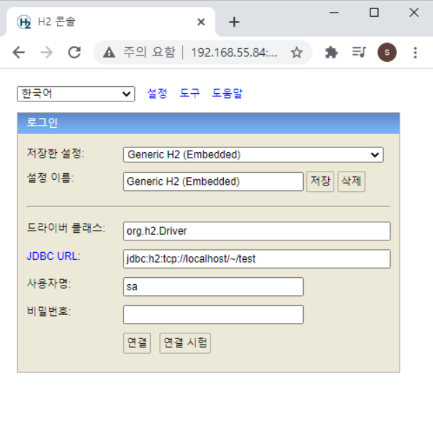

* 연결 버튼을 눌러 접속할 수 있다.

* 그러면 이렇게 SQL을 실행할 수 있는 창으로 들어오게 된다!

  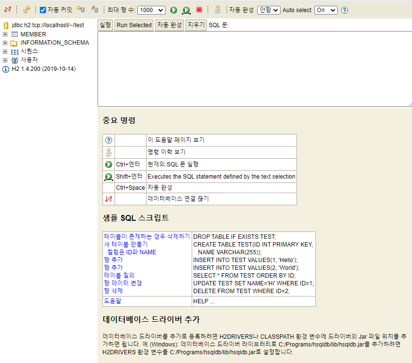


<br/>

#### 테이블 생성하기

> 테이블을 생성하는 SQL문 실행

```sql
drop table if exists member CASCADE;
create table member
(
 id bigint generated by default as identity,
 name varchar(255),
 primary key (id)
);
```

<br/>

> 튜플을 추가하는 SQL문 실행

```sql
insert into member(name) values('spring')
```

<br/>

### 순수 Jdbc

* 정신 건강을 위해 흐름만 파악하고 넘어가자.
* 예전에는 이렇게 복잡한 방법으로 하나하나 코딩했다고 한다.

<br/>

#### DB 접근을 위한 작업

```properties
implementation 'org.springframework.boot:spring-boot-starter-jdbc'
runtimeOnly 'com.h2database:h2'
```

* 먼저 **build.gradle** 파일에 db관련 라이브러리를 추가해준다.

<br/>

```properties
spring.datasource.url=jdbc:h2:tcp://localhost/~/test
spring.datasource.driver-class-name=org.h2.Driver
spring.datasource.username=sa
```

* 이어서 **applicatio.properties**에 접근할 DB의 URL과, DB 이름을 추가해준다.
* 이렇게 추가만 해주면 스프링이 다~ 알아서 해준다.
  * 만약 빨간불이 뜨면, 필요한 라이브러리가 다운되지 않아서 그렇다.
  * gradle을 다시 새로고침 해서 빌드해주자.
* 마지막 줄은 스프링 2.4 이후 버전부터 꼭 붙여주어야 id password 오류가 발생하지 않는다고 한다.
* 여기까지 하면 DB에 접근할 준비가 끝!

<br/>

#### DataSource

> 자바에서 DB에 붙을 때, connection pool을 지원하기 위한 인터페이스

* 순수 jdbc로 DB 접근을 하면, 접근 할 때마다 connection을 맺고 끊는 작업을 한다.
* 이 작업을 줄이기 위해, DB에 접근하고자 하는 사용자에게 미리 생성된 connection을 제공하고 돌려받는다.
* 이 connection들을 모아두는 장소를 connection pool이라고 한다.
* DataSource는 자바에서 이 connection pool을 지원하기 위한 인터페이스이다.
  * import javax.sql.DataSource; 경로를 추가해 사용한다.
  * 얘는 스프링한테 주입 받아야한다.

<br/>

#### DataSourceUtils

```java
private Connection getConnection() {
	return DataSourceUtils.getConnection(dataSource);
}

private void close(Connection conn) throws SQLException {
	DataSourceUtils.releaseConnection(conn, dataSource);
}
```

* DB와 연동이 될 때 트랜잭션 등이 생겨 롤백하는 경우 등이 생길 수도 있다.
* database connection을 유지해야 하는데, 그렇게 하기 위해 Spring을 쓸 때는 반드시 **DataSourceUtils**를 이용해 Connection을 가져오고, Close를 해야한다고 한다.

<br/>

#### Jdbc 리포지토리 구현

> 이 방식의 코드는 어차피 안쓸거니까 Ctrl + V

* 간단한 쿼리로 데이터를 받는 간단한 예제인데도 Jdbc를 사용하는 코드는 메소드마다 매우 복잡하다.
* 겁나 하드코딩... 그냥 맛보기로 **이런 식으로 코딩한다**에 대한 흐름만 이해하자.

```java
@Override
public Member save(Member member) {
    String sql = "insert into member(name) values(?)";
    Connection conn = null;
    PreparedStatement pstmt = null;
    ResultSet rs = null;
    try {
        conn = getConnection();
        pstmt = conn.prepareStatement(sql,
                                      Statement.RETURN_GENERATED_KEYS);
        pstmt.setString(1, member.getName());
        pstmt.executeUpdate();
        rs = pstmt.getGeneratedKeys();
        if (rs.next()) {
            member.setId(rs.getLong(1));
        } else {
            throw new SQLException("id 조회 실패");
        }
        return member;
    } catch (Exception e) {
        throw new IllegalStateException(e);
    } finally {
        close(conn, pstmt, rs);
    }
}
```

* **getConnection()** 해서 커넥션을 가지고 온다.
* 커넥션에서 **prepareStatement()**에 sql문과 Statement.RETURN_GENERATED_KEY 옵션을 넣어 **P**repared**St**ate**m**en**t**를 받아온다.
* pstmt.setString() 해서 인덱스와 멤버를 매칭시켜준다.
* pstmt.executeUpdate()를 해서 실제 쿼리를 날리고, 결과 **ResultSet**을 받아온다.
* result로 pstmt.getGeneratedKeys()를 통해 ID(Key)들을 꺼내준다.
* 값이 있으면 꺼내고, 실패하면 조회 실패.
* 끝나고서는 **반드시 close(conn, pstmt, rs)**를 통해 자원들을 반환해주어야 한다.
  * 안해주면 계속 자원이 쌓이고 쌓이다가 대 장애의 참사가 날 수도...
* 근데 맛보기만 보자. 어차피 이 코드 안쓸꺼야... 고전 스타일 그대로 쓴 것!!

<br/>

#### 리포지토리 변경 - 설정파일 바꾸기

> @Configuration에서, 구현한 파일을 @Bean으로 등록해주기

* 하드코딩으로 작성해 준 JdbcRepository를 MemberRepository로 쓰기 위해서는 설정파일을 바꿔줘야 한다.

* 전에 만든 SpringConfig라는 @Configuration 설정파일에서 @Bean으로 등록한 memberRepository에 JdbcMemberRepository 인스턴스를 반환해주도록 수정한다.

  ```java
  @Bean
  public MemberRepository memberRepository() {
  	//return new MemoryMemberRepository();
      return new JdbcMemberRepository(dataSource);
  }
  ```

* 이 때 DB에 접근하기 위한 DataSource 객체를 주입 받는데, 이는 스프링에서 알아서 생성해 주입시켜준다.

  ```java
  DataSource dataSource;
  
  @Autowired
  public SpringConfig(DataSource dataSource) {
  	this.dataSource = dataSource;
  }
  ```

  * DataSource를 @Autowired를 이용한 생성자 주입 방식으로 스프링으로부터 주입 받는다.
  * 그럼 DataSource가 미리 스프링 컨테이너 안에 빈으로 등록되어 있어야 하는 것 아닌가?
  * 이는 전에 properties에서 설정해준 내용을 보고 Spring이 알아서 생성하여 Bean으로 등록한 상태이다.
    * 스프링은 알아서 다 해준다.

* 이렇게 하면 다른 어떤 코드를 변경하지 않고도 리포지토리를 H2 DB repository로 교체하여 쓸 수 있다.

<br/>

#### 이래서 스프링을 쓴다.

* 과거의 코드라고 한다면, 하나의 코드를 수정하면 그와 연관된, 의존하는 코드를 모두 하나하나 찾아가며 바꿔주어야 한다.
* 하지만 지금 우리가 해준 건, JdbcMemberRepository라는 인터페이스 구현체를 하나 더 만들어주고, 스프링이 제공하는 Configuration 설정 파일을 변경해줬을 뿐이다!!
* 다시 외쳐. 스프링 짱짱맨.

<br/>

* 의존 관계는 다음과 같다.

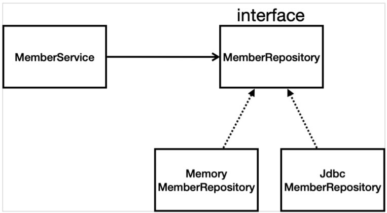

* 인터페이스를 만들어 메모리 리포지토리 구현체와, Jdbc 리포지토리 구현체를 구현한다.

<br/>

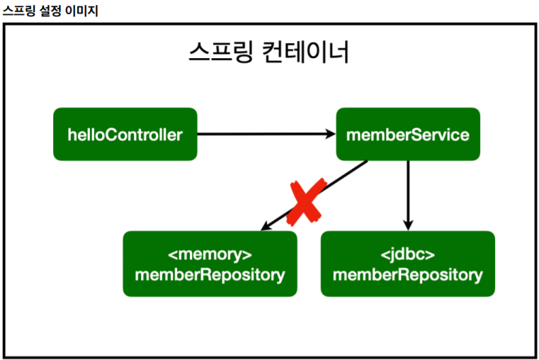

* [SOLID](https://ko.wikipedia.org/wiki/SOLID_(%EA%B0%9D%EC%B2%B4_%EC%A7%80%ED%96%A5_%EC%84%A4%EA%B3%84)) 에 대해 공부해보자.
* **개방-폐쇄 원칙** (OCP, Open-Closed Principle)
  * 확장에는 열려있고, 수정, 변경에는 닫혀있다.
  * 객체지향의 다형성 개념을 활용하는 기법.
* 여기서 스프링의 장점이 나오는데, 처음에는 메모리에 저장하는 메모리 리포지토리를 연결했었다.
* 이 때, **기존 코드는 손대지 않고, 스프링 빈 등록이나 의존 관계를 관리하는 Config 파일만 수정해주었다.**
* 이렇게 스프링의 **DI** (Dependencies Injection)를 사용하면 기존 코드를 전혀 손대지 않고, 설정만으로 구현 클래스를 변경할 수 있다.
  * 내가 해준 것은 스프링 빈에 등록하는 @Bean 어노테이션 코드만 작성했고, 의존성 주입은 스프링이 알아서 매핑하여 해주는 것이다.

<br/>

### 스프링 통합 테스트

* 앞서 했던 테스트들은 사실, 순수 Java code 만 가지고 했던 테스트일 뿐 스프링과는 관련 없었다.
* 이제는 스프링과 연관시켜서 DB도 다 활용한 테스트를 진행한다. 이름하여 스프링 통합테스트.
* 테스트 할 때는 그냥 필요한 것들을 주입해서 사용하고 끝이니까, 편한 방법을 쓰는게 좋다.
  * Constructor 대신 Field injection으로 @Autowired 해서 쓰자.
* 하지만 되도록이면 최대한 테스트를 분할하여 단위 테스트 형태로 스프링 없이 수행하는 연습을 하자.

<br/>

#### @SpringBootTest

> 스프링 부트 테스트를 위한 어노테이션

* 한 줄이면 끝난다.
* 스프링 컨테이너와 테스트를 함께 실행한다.
* 진짜 스프링을 띄우는 것과 같이 동작.

<br/>

#### @Transactional

> 테스트 시작 전에 트랜잭션을 시작하고, 완료 후에는 항상 Rollback한다.

* 테스트 클래스에 이게 붙어있으면, 테스트 시작 전에 트랜잭션을 시작하고, 완료 후에는 항상 Rollback한다.
* 테스트 코드로 인해 생성되는 데이터가 실제 DB에 영향을 주지 않는 것이다.
* 즉, 각 메소드마다 트랜잭션을 시작하고 - 테스트 하고 - 롤백한다.
  * DB가 반영되는 과정은 이렇다.
  * SQL 쿼리문이 수행되고 - 최종적으로 바뀐 내역을 Commit 해야지만 실제 DB에 반영이 된다.
  * 하지만 Commit을 하기 전에 Rollback을 하게되면 바뀐 내역이 DB에 반영되지 않는 것이다.
  * 트랜잭션 시작 전으로 돌아가는 것.
* 이전 테스트에서는 DB가 아닌 로컬 Repository 객체에 데이터를 담았기 때문에, @AfterEach @BeforeEach 등을 사용해서 각 메소드들이 수행되기 전에 DB 내용을 비운 후 사용하는 등의 방법을 이용했었다.
* 하지만 이제 DB를 이용한 테스트에서는 그런걸 쓸 필요가 없어진 것!

<br/>

#### @Commit

> DB에 쿼리 수행 내용을 반영한다.

* 위에 Transactional과는 반대로 수행한 결과를 반영하고 싶을때는 이 어노테이션을 사용한다.
* 근데, 굳이 안써도 Transactional을 안붙이면 수행 되지 않나...(?)

<br/>

### 스프링 JdbcTemplete

* 순수 Jdbc와 동일한 환경설정을 하면 된다.
* 스프링 JdbcTemplate과 **MyBatis** 같은 라이브러리는 JDBC API에서 본 **반복 코드를 대부분 제거**해준다. 
* 하지만 SQL은 직접 작성해야 한다.

<br/>

```java
private final JdbcTemplate jdbcTemplate;

@Autowired
public JdbcTemplateMemberRepository(DataSource dataSource) {
    this.jdbcTemplate = new JdbcTemplate(dataSource);
}
```

* JdbcTemplate은 injection 받을 수 없어서, Data source를 주입 받아서 넣어준다.

<br/>

```java
@Override
public Optional<Member> findById(Long id) {
    List<Member> result = jdbcTemplate.query("select * from member where id = ?", memberRowMapper());
    return result.stream().findAny();
}
```

* connection 받아오고 statment 받아오고 쿼리 날리고.. close 하고... 하던 기존 순수 jdbc 코드에 비하면...
* 같은 기능을 수행하지만, 단 두 줄만에 끝난다.
* 물론 그 순수 jdbc에서 수행하는 기능을 내부적으로 내가 신경쓰지 않아도 알아서 수행되는 것이다.

<br/>

```java
private RowMapper<Member> memberRowMapper() {
    return (rs, rowNum) -> {
        Member member = new Member();
        member.setId(rs.getLong("id"));
        member.setName(rs.getString("name"));
        return member;
    };
}
```

* 매핑된 memberRowMapper 메소드이다.
* 쿼리문의 결과값에 대한 처리를 해주는 메소드로, 데이터를 객체로 만들어서 반환한다.

<br/>

* Templete Method Pattern
  * 나중에 찾아보고 공부해보자. 이게 적용이 많이 된 템플릿이라서 jdbc templete 이라고 한다.

<br/>

```java
SimpleJdbcInsert jdbcInsert = new SimpleJdbcInsert(jdbcTemplate);
jdbcInsert.withTableName("member").usingGeneratedKeyColumns("id");

Map<String, Object> parameters = new HashMap<>();
parameters.put("name", member.getName());
```

* 템플릿은, 위와 같이 member, id, name 등을 주면 알아서 SQL문을 만들어준다.
* 되게 편리하게 제공하는 라이브러리. 편하다 라고만 알고 넘어가자. 기능 설명하려면 또 한 세월...

<br/>

<br/>

<br/>

### JPA

* Java Persistence API : DB 관리를 표현하는 자바 API이다. (표준 인터페이스)
  * 객체와 ORM이라는 기술
    * Object Relational Mapping
  * 그 중 여기서는 구현체로 제공되는 hibernate 라이브러리를 사용하게 된다.
* JPA는 기존의 반복 코드는 물론이고, 기본적인 SQL도 JPA가 직접 만들어서 실행해준다.
* JPA를 사용하면, SQL과 데이터 중심의 설계에서 객체 중심의 설계로 패러다임을 전환을 할 수 있다.
* JPA를 사용하면 개발 생산성을 크게 높일 수 있다.

<br/>

#### 사용 방법

* 먼저 build.gradle 파일에 다음을 추가한다.

```java
implementation 'org.springframework.boot:spring-boot-starter-data-jpa'
```

* application properties 파일에도 다음을 추가한다.

```properties
spring.jpa.show-sql=true
spring.jpa.hibernate.ddl-auto=none
```

* auto = create로 변경하면 객체를 보고 테이블까지도 알아서 다 만들어준다.

<br/>

#### EntityManager

* JPA는 Entity Manager 라는 것으로 모든게 동작한다.
* 앞서 properties랑 gradle 파일에서 선언해 준 정보들이랑, Database Connection 정보들을 알아서 잘 모아서 스프링 부트가 Entity Manager라는 것을 만들어준다.
* 즉, 해당 객체 내부에 DataResource 정보를 다 가지고 있어서 내부적으로 DB와 통신을 다 처리를 한다.
* **결론적으로, JPA를 쓰려면 Entity Manager를 스프링으로부터 주입 받아야 한다.**

<br/>

<br/>

#### 스프링 데이터 JPA

<br/>

<br/>

<br/>

<br/>

<br/>

## Error Issue!

<br/>

### java.lang.NoClassDefFoundError:

Error:gradle-resources-test:hello-spring.main: java.lang.NoClassDefFoundError: org/apache/tools/ant/util/ReaderInputStream

* 해결 방법을 못찾았다...
* 캐시도 지우고 리빌드, 재시작, 재부팅, 여러가지로 해봤지만 해결을 못했다...
* 결국 새 프로젝트를 만들어서 기존의 코드를 다 옮기는 것으로 해결했다.

<br/>

#### 테스트 코드에 한글 가능, But 깨짐 현상

* 콘솔에 출력되는 부분은 한글이 문제없이 잘 나왔다.
* 하지만 인텔리제이 프로그램 자체에서 표시하는 한글이 깨지는 문제가 발생했다.
* 분명 테스트 케이스에서 메소드 이름으로 한글을 사용 한다고 했는데..
* 인코딩 문제인가 싶어 UTF-8로 전부 바꾸고 적용했지만 해결이 안되더라.

<br/>

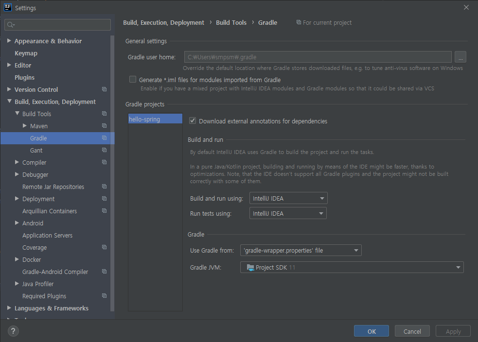

* 나중에 알고보니, 테스트 실행하는 것이 Gradle로 설정되어 있어서 그랬던 것 같다.
* 설정에서 Gradle의 Build and run using과 Run tests using 부분을 intelliJ로 변경하니 해결되었다.
* 실행 또한 속도면에서도 IDE로 설정해놓는 것을 권장한다고 한다.

<br/>

### JdbcSQLInvalidAuthorizationSpecException: 

#### Wrong user name or password

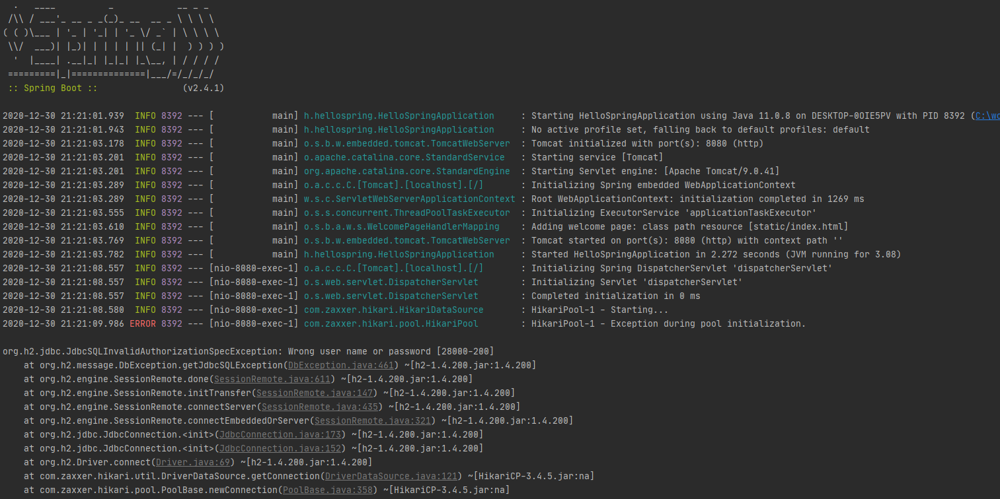

* 지금 상황은, 기존의 메모리 리포지토리에서 새로 만든 H2 DB로 교체하는 작업을 수행한 상태이다.
* 이 때, 기존에 저장된 회원 목록을 조회하는 기능을 수행하는 도중 에러가 발생한다.
* 강의에서 하시는 그대로 토씨하나 틀리지 않고 똑같이 잘 했는데 어째서 에러가 나는 것일까.
* IDE는 친절하다. 차근차근. 에러 코드를 확인해보자.

<br/>

```
JdbcSQLInvalidAuthorizationSpecException: Wrong user name or password
```

* user 이름이나 비밀번호가 틀렸다고 한다.
* 해당 에러에 대해 검색해보니, [스프링 부트 2.4 에서는 DB 커넥션 오류 해결을 위해 패치](https://www.inflearn.com/questions/94189)가 되었단다.
* 그래서 반드시 properties 파일에 **"spring.datasource.username=sa"** 를 써주어야 한다고 한다.

<br/>

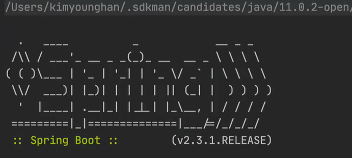

* 혹시 몰라 강사님의 화면을 멈춰 확인해보니... 그러네. 2.3.1 버전이었다. 내꺼는 2.4.1 버전.
* 다행히 금방 해결된 오류였다.

<br/>

### JUnit 테스트는 항상 트랜잭션을 롤백한다.

#### @Rollback(false)

* 오류..까지는 아니고, 테스트를 할 때 연결 된 DB에 join 하는 기능을 수행했지만 DB에 남는 데이터가 없었다.
* 찾아보니, 기본적으로 '테스트' 이기 때문에 기능 수행 후에 Default로 Rollback을 하는 것 같았다.

* 이를 방지하기 위해 @Rollback 어노테이션에 인자를 (false)로 주면 수행한 결과 그대로 반영했다.
* 반대로 기본값이 true 일테니, 어노테이션을 쓰지 않으면 롤백을 수행하는 듯 하다.

...

* 아. @Transactional 이라는 어노테이션을 붙여주면 기본적으로 rollback을 해준다.

<br/>