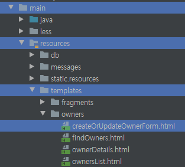
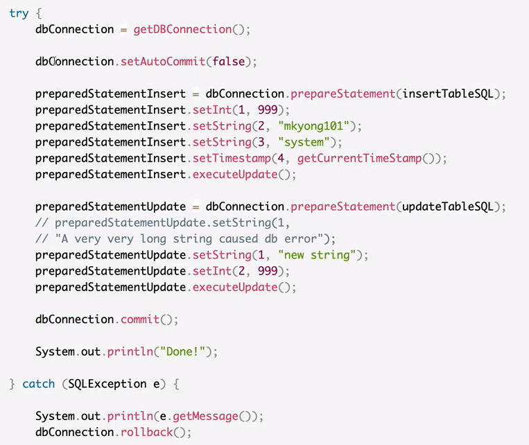

# Class Memo

<br/>

#### 요약

* 스프링의 핵심은 IoC, AOP, PSA 이다.
* IoC에서 의존성 주입은, 필요한 객체를 외부에서 스프링이 넣어주는 방식이다. 
  * 테스트도 쉽고, 코드 작성이 용이하다.
* AOP는 사방으로 흩어져서 작성된 코드를 한곳으로 모으는 코딩 기법이자 기술이다.
  * logging이나, 트랜잭션, 성능측정, 인증, 권한 확인 등...
  * 그 중 spring은 proxy 라는 패턴을 이용해서 구현한다.
  * 또는 byte code를 변경해서 구현하기도...
* 대부분의 라이브러리는 전부 PSA이고, Spring이 제공하는 API 대부분이 PSA이다.
  * 조금 더 유연하게 대처할 수 있는 추상화 된 좋은 인터페이스를 제공하는 것이다.

<br/>

<br/>

## 프로젝트 준비

* JDK 버전: 11 이상

* 소스 코드: https://github.com/spring-projects/spring-petclinic 

* 실행 방법

  > ./mvnw package

  * package 라는 빌드를 수행하면, 프로젝트를 빌드 해서 패키지 파일을 만든다.
  * 패키징이라는 옵션으로 타입을 지정해주지 않으면 default 프로젝트 타입은 jar 파일

  > java -jar target/*jar

  * 현재 디렉토리 하위에서 jar 파일을 찾아 실행하는 명령어

  > IDE에서 메인 애플리케이션 실행

  * Spring boot 기반 프로젝트이기 때문에, Application java 파일을 run 하는 방법으로 가능

<br/>

<br/>

### 프로젝트 살펴보기

<br/>

#### 프로젝트 Flow가 어떻게 될까?

* 예시로, home에서 새로 고침을 한다.
* 그러면 owners/find 라는 요청이 오면, spring의 디스패처 서블릿으로 가게 된다.
* Dispacher Servlet은 ownerController에 있는 매핑된 메소드를 호출하게 된다.

<br/>

#### 기존 코드를 조금 고쳐보기

* LastName이 아닌 FirstName으로 검색하도록
  * View 변경
  * 코드 조금 변경
* 앞에서부터 일치하는게 아닌 해당 키워드가 들어있는 걸 검색하도록
  * 쿼리 일부 변경
* Owner에 age 항목 추가
  * Model 변경
  * DB Schema 및 Data 변경
  * View 변경

<br/>

#### Issue

* SQL column 문제
  * DB 스키마 및 데이터 파일을 수정해주어 해결했다.
* No validator could be found for constraint 'java.lang.Integer'
  * @NotEmpty 어노테이션을 문자열이 아닌 Integer 형에 써서 그런 것 아니었을까 싶다.
* View 에서 추가한 age의 default value="0" 으로 계속 나오는 문제
  * Owner의 age 필드를 int형으로 선언해줘서 그랬던 것 같다. Integer로 수정하니 해결

<br/>

<br/>

## 스프링 IoC

### IoC (Inversion of Control)

> 제어권이 역전된 것

<br/>

#### 일반적인 의존성에 대한 제어권

```java
class OwnerController {
	private OwnerRepository repository = new OwnerRepository();
}
```

* 자기가 사용할 객체는 new 생성자로 알아서 만들어 쓴다!
* OwnerReopsitory를 OwnerController 본인이 사용하기 위해 직접 만드는 것.
* 의존성에 대한 제어권을 스스로가 가지고 있다.

<br/>

#### IoC, 제어권의 역전

```java
class OwnerController {
	private OwnerRepository repo;
	
    public OwnerController(OwnerRepository repo) {
		this.repo = repo;
	}
	// repo를 사용합니다.
}

class OwnerControllerTest {
	@Test
	public void create() {
		OwnerRepository repo = new OwnerRepository();
		OwnerController controller = new OwnerController(repo);
	}
}
```

* 자기가 사용할 객체는 타입만 맞으면 외부에서 알아서 넣어준다.
* 위의 경우는 OwnerController에서 사용할 OwnerRepository를 외부에서 넣어준다.
* 이로써 의존성을 관리해주는 것이 자신이 아니라 다른 누군가가 해주는 것으로 바뀌었다.
* 이 개념이 바로 의존성 주입 (Dependency Injection) 이다.

<br/>

* 이렇게 스프링은 Bean이라는 객체를 만들어 객체로 등록을 해준다.
* 등록된 객체들은 Spring Container 안에 있으니까 Bean 이라고 부르는 것.
* 이 Bean들의 의존성을 관리해준다. 즉, 필요한 의존성을 서로 주입 해주는 역할을 수행하는 것이다.
  * 의존성 주입은 Bean 끼리만 가능하다.

<br/>

<br/>

### 스프링 IoC 컨테이너

> = Application Context (BeanFactory) 라고도 한다.

* Bean을 만들고, Bean 사이의 의존성을 엮어주며, 컨테이너가 가지고 있는 Bean을 제공한다.
* 스프링이 ~을 해준다. 라고 말할 때 그 '스프링'  주체 역할을 해주는게 이 녀석.

<br/>

#### ApplicationContext, BeanFactory

* 해당 코드는 가장 핵심적인 클래스이긴 하지만, 우리가 직접 참고해서 쓸 일이 거의 없다.
* 굳이 쓰려면 @Autowired를 이용해 Bean에 주입을 받아서 쓸 수는 있다.
* BeanFactory가 사실상 IoC 컨테이너이고, ApplicationContext는 BeanFactory를 상속받고 있다.
* 같은 역할을 하지만, ApplicationContext가 훨씬 더 다양한 일을 하긴 한다.

<br/>

#### 직접 사용하기

```java
private ApplicationContext applicationContext;

public OwnerController(ApplicationContext applicationContext) {
		this.applicationContext = applicationContext;
}

@GetMapping("/bean")
@ResponseBody
public String bean() {
	return "bean: " + applicationContext.getBean(OwnerController.class);
}
```

* 위의 경우와 같이, 스프링에서 제공하는 ApplicationContext를 직접 선언 및 주입받아 사용할 수도 있긴하다.
* 하지만 이렇게 getBean의 형식으로 직접 가져오는 식의 코딩을 할 일은 거의 전혀 수준으로 없다고...
* 직접 쓸 필요 없이 어차피 스프링이 알아서 주입 해주기 때문.

<br/>

#### Bean은 싱글톤 객체

```java
private final OwnerRepository owners;
private ApplicationContext applicationContext;

public OwnerController(OwnerRepository clinicService, ApplicationContext applicationContext) {
	this.owners = clinicService;
	this.applicationContext = applicationContext;
}

@GetMapping("/bean")
@ResponseBody
public String bean() {
	return "bean: " + applicationContext.getBean(OwnerRepository.class) + "\n"
		+ "owners: " + this.owners;
}
```

* 직접 생성한 ApplicationContext에서 getBean()을 이용해 가져온 OwnerRepository 클래스를 출력한다.
* 스프링에 의해 주입 받은 owners 객체 변수를 출력한다.
* 출력된 각 클래스의 Hash 값은 당연히 같다.
* 스프링 IoC 컨테이너에 등록된 Bean 객체는 싱글톤으로 하나만 존재하고, 재사용되기 때문.

<br/>

* 싱글톤 스코프를 직접 구현하려면 그 과정이 굉장히 번거롭고 조심스러운 일이다.
* 그런 일을 IoC 컨테이너를 사용하면 손쉽게 등록하고 편하게 사용할 수 있다.
* 이것 역시 IoC 컨테이너를 사용하는 이유 중 하나!

<br/>

#### 참고

* [application context에 대한 설명 - github](https://github.com/spring-guides/understanding/tree/master/application-context)
* [ApplicationContext에 대한 설명 - 공식 Reference](https://docs.spring.io/spring-framework/docs/current/javadoc-api/org/springframework/context/ApplicationContext.html)
* [BeanFactory에 대한 설명 - 공식 Reference](https://docs.spring.io/spring-framework/docs/current/javadoc-api/org/springframework/beans/factory/BeanFactory.html)

<br/>

<br/>

### 빈(Bean)

> 스프링 IoC 컨테이너가 관리하는 객체

* 콩...ㅋㅋ
* 스프링 안에서 만들어지는 모든 객체들을 빈이라고 표현한다.
* 다른 말로, Application Context가 관리하는 모든 객체가 Bean이다.
* 스프링 IoC 컨테이너 안에서 관리되는 모든 객체가 Bean이다.
  * IntelliJ IDE에서는, 좌측에 녹색 콩 모양이 떠있으면 Bean으로 등록되어 관리되는 클래스들이다.
* IoC 컨테이너에 등록되지 않은, new 생성자를 이용해 임의로 만든 객체는 Bean이 아니다.

<br/>

#### Bean으로 등록하는 방법 1 - Component Scan

> @Component가 달린 클래스의 인스턴스를 Bean으로 알아서 등록해주는 Annotation processor

* Annotation 프로세서중에, 스프링 IoC 컨테이너를 만들고 그 안에 Bean을 등록할 때 사용하는 인터페이스들이 있는데, 이걸 Lifecycle callback 이라고 부른다. 
* 여러가지 Lifecycle callback 중에, @Component라는 어노테이션들을 찾아서 그 클래스의 인스턴스를 만들어 Bean으로 등록해주는 복잡한 기능을 하는 어노테이션 처리기가 등록되어 있다.
* 그게 바로 @ComponentScan 이다.
  * 일반적으로 Application 클래스에 달린 @SpringBootApplication에 포함되어 있다.
  * @ComponentScan이 달린 파일 기준으로 하위 경로의 모든 클래스들을 돌면서 @Component가 달린 것들을 찾아 Bean으로 등록해준다.
  * @Component가 포함되는 어노테이션들의 예시는 다음과 같다.
    * @Controller
    * @Service
    * @Repository
      * Repository는 JPA라는 기술에 따라서, 특정 인터페이스를 상속 받음으로서 

<br/>

#### Bean으로 등록하는 방법 2 - XML, 설정파일

> @Configuration 적용 파일에 @Bean 어노테이션으로 직접 등록하는 방법

* @Configuration 어노테이션이 적용된 -Config라는 파일을 정의한다.

* 등록하고자 하는 클래스의 생성자를 만들어 new 를 이용해 해당 객체를 반환하고, 해당 메소드 상단에 @Bean 어노테이션을 추가해서 직접 IoC 컨테이너에 Bean으로 등록할 수 있다.

  * ```java
    @SpringBootApplication(proxyBeanMethods = false)
    public class PetClinicApplication {
    
    	@Bean // 어노테이션
    	public String sanggoe() {
    		return "sanggoe";
    	}
    
    	public static void main(String[] args) {
    		SpringApplication.run(PetClinicApplication.class, args);
    	}
    
    }
    ```

<br/>

#### Bean을 꺼내 쓰는 방법

* @Autowired 또는 @Injection
* ApplicationContext에서 getBean()으로 직접 꺼내는 방법
  * 이건 별로 권장하지 않는 방법

<br/>

#### 특징

* 오로지 "빈" 만 의존성을 관리 한다. 빈이 아닌 것들은 의존성을 관리하지 않는다.
* 클래스는 Bean 이 되어야 해요~

<br/>

### 의존성 주입 (Dependency Inection)

> 필요한 의존성을 어떻게 받아올 것인가?

<br/>

#### @Autowired / @Inject를 어디에 붙이는가?

* Constructor
  * 어떠한 클래스에 반드시 필요한 의존성이면 생성자에 붙이는 것을 추천!
  * Bean이 되는 클래스에 **생성자가 하나만 있고**, 생성자에 **매개변수 Type이 빈으로 등록되어 있다면** @Autowired가 없더라도 그 **Bean을 주입해준다.**
    * 다른 말로, 위의 경우라면 스프링 4.3 버전 이상부터는 Autowired나 Inject를 생략할 수 있다.
* Setter
  * 여기에다가도 붙일 수 있다. 우선 순위는 두 번째.
  * 하지만 Setter를 이용해 의존성을 주입하는 방법은 다소 위험한 코드가 될 수 있다.
  * 생성자로 의존성을 주입하면 한 번 생성한 이후로 바뀔 염려가 없지만, Setter를 이용하면 외부에서 주입이 다시 일어나는 등의 변동이 생길 우려가 있기 때문.
* Field
  * Setter도 없다면, 필드 위에다가도 @Autowired를 붙일 수 있다.
  * 생성자에서 안하고 IoC 컨테이너에 Bean으로 등록된 객체를 알아서 넣어달라고 할 수 있는 것.

<br/>

#### Tip!

* 만약 의존성 주입이 만족이 안되면 Application 자체가 뜨지 않는다. 아래와 같이 에러난다!
  * No qualifying bean of type 'org.springframework.[path]'
* 스프링 프레임워크는 권장하는 방법은 생성자 Injection이다.
  * Field injection이나 Setter injection은 의존성이 없이도 인스턴스를 만들 수 있다.
  * 다만 순환 참조가 발생할 수 있는데, 이런 경우는 두 injection 방법을 사용해 상호 참조 문제를 해결 할 수 있다.
  * 그래도 가급적 상호 참조를 줄이는 것을 권장한다고 합니다!

<br/>

#### 연습) OwnerController에 PerRepository 주입하기

```java
@Autowired // Field injection
private PetRepository petRepository;

@Autowired // Setter injection
public void setPetRepository(PetRepository petRepository) {
   this.petRepository = petRepository;
}

@Autowired // Constructor injection
public OwnerController(PetRepository petRepository) {
   this.petRepository = petRepository;
}
```

<br/>

<br/>

## AOP (Aspect Oriented Programming)

> 흩어진 코드를 한곳으로 모으는 코딩 기법

<br/>

### AOP에 대한 설명

#### 흩어진 AAAA와 BBBB

```java
class A {
	method a () {
		AAAA
		오늘은 7월 4일 미국 독립 기념일이래요.
		BBBB
	}
	method b () {
		AAAA
		저는 아침에 운동을 다녀와서 밥먹고 빨래를 했습니다.
		BBBB
	}
}
class B {
	method c() {
		AAAA
		점심은 이거 찍느라 못먹었는데 저녁엔 제육볶음을 먹고 싶네요.
		BBBB
	}
}
```

* 흩어져있는 코드의 경우, 같은 역할을 하는게 난잡하게 흩어져있다.
* 하나를 고치면, 사용된 모든 곳에 가서 하나하나 다 바꿔주어야 한다...

<br/>

#### 모아 놓은 AAAA와 BBBB

```java
class A {
	method a () {
		오늘은 7월 4일 미국 독립 기념일이래요.
	}
	method b () {
		저는 아침에 운동을 다녀와서 밥먹고 빨래를 했습니다.
	}
}
class B {
	method c() {
		점심은 이거 찍느라 못먹었는데 저녁엔 제육볶음을 먹고 싶네요.
	}
}
class AAAABBBB {
	method aaaabbb(JoinPoint point) {
		AAAA
		point.execute()
		BBBB
    }
}
```

* 이걸 한 곳으로 모아서 흩어진 코드를 호출 하고, 각 메소드를 호출하도록 기능을 모아서 정리해 놓는 것이다.
* 이렇게 하면 객체지향 기법에 맞게 메소드 역시 자신이 해야할 일만 수행하도록 할 수 있다.

<br/>

#### AOP 예시

* 쉬운 이해를 위해 예를 들면, 아래와 같이 메소드 수행 시간을 알고자 기능을 추가하고 싶다고 가정하자.

```java
public void method1() {

    // AAAA
    StopWatch stopWatch = new StopWatch();
	stopWatch.start();
    // AAAA
	
	// 메소드의 기능이 수행되는 코드
	
    // BBBB
	stopWatch.stop();
	System.out.println(stopWatch.prettyPrint());
    // BBBB
}
```

* 위 기능들을 나누어 AAAA, BBBB 라고 가정하자.
* 근데, 이 기능을 다른 메소드에서도 사용하고 싶다.

```java
public void method2() {

    // AAAA
    StopWatch stopWatch = new StopWatch();
	stopWatch.start();
    // AAAA
	
	// 메소드의 기능이 수행되는 코드
	
    // BBBB
	stopWatch.stop();
	System.out.println(stopWatch.prettyPrint());
    // BBBB
}
```

* 마찬가지로 method2에서도 AAAA와 BBBB를 넣었다.
* 한 두 개 정도야 괜찮겠지만, 10개, 20개... 사용하는 곳이 많아진다면? 이를 해결하고자 하는 것이다.

<br/>

### 다양한 AOP 구현 방법

> 컴파일

* A.java ----(AOP)---> A.class : (AspectJ)
  * 자바 코드에는 AAAA와 BBBB가 없지만, 컴파일 된 클래스에는 해당 코드가 추가되어 컴파일 되도록 해주는 클래스가 존재하는데, 그게 바로 AspectJ 라는 것이다.

> 바이트코드 조작

* A.java -> A.class ---(AOP)---> 메모리 : (AspectJ)
  * 컴파일 한 class 파일을 사용할 때, runtime에서 Class loader가 읽어온다.
  * 읽어와서 메모리에 올릴 때 그 때 조작하는 방법이다.
  * 메모리상에 메소드에서는 AAAA와 BBBB코드가 들어간 상태인 것.

> 프록시 패턴 (스프링 AOP가 사용하는 방법)

* 디자인 패턴 중 하나를 사용해서 AOP와 같은 효과를 내는 방법
  * 기존의 코드를 건드리지 않고 그 객체를 다른 객체로 바꾸는 방법.
  * 클라이언트 코드에 영향을 적게 주면서...
  * [이해하기 위한 링크](https://refactoring.guru/design-patterns/proxy)

<br/>

#### Proxy Pattern 구현하기

> 기존 코드를 건드리지 않고 새 기능 추가하기

<br/>

```java
public interface Payment {
	void pay(int amount);
}
```

* Payment라는 결제 인터페이스가 있다.
* 기능으로는 결제 pay 메소드가 존재한다.

<br/>

```java
public class Store {
   Payment payment;
   @Autowired
   public Store(Payment payment) {
      this.payment = payment;
   }
   public void buySomthing(int amount) {
      payment.pay(amount);
   }
}
```

* Store 클래스에서는 Payment를 주입 받고, buySomething이라는 메소드를 통해 결제 pay 기능을 수행한다.

<br/>

```java
public class Cash implements Payment{
   @Override
   public void pay(int amount) {
      System.out.println(amount + " 현금 결제");
   }
}
```

* Cash 클래스는 Payment를 구현하고 있는 클래스이다.
* pay 메소드를 구현하여 현금 결제 기능을 수행한다.

<br/>

* 이 시점에서, pay를 호출할 때 StopWatch로 메소드 수행 시간을 출력하는 기능을 추가하고 싶다.
* 이를 기존의 코드인 Store나 Cash 클래스는 건드리지 않고 프록시 패턴으로 해결할 수 있다.

```java
public class CashPerf implements Payment {
   Payment cash = new Cash();

   @Override
   public void pay(int amount) {
      StopWatch stopWatch = new StopWatch();
      stopWatch.start();

      cash.pay(amount);

      stopWatch.stop();
      System.out.println(stopWatch.prettyPrint());
   }
}
```

* CashPerf 클래스 역시 Payment를 구현한다.
* 기존의 구현체인 Cash 클래스도 객체로 가지고 있는다.
* 이 때 같은 pay 기능을 수행하는 대신 StopWatch로 수행 시간을 측정하는 기능도 수행한다.
* 이렇게 하면 수행시간 측정 기능이 추가된 채로, 기존의 cash 객체가 pay 기능을 수행하는 것은 동일하다.

<br/>

```java
class StoreTest {
	@Test
	public void testPay() {
		Payment cashPerf = new CashPerf(); // new Cash() 로 하면 100 현금 결제 기능만 수행
		Store store = new Store(cashPerf);
		store.buySomthing(100);
	}
}
```

* 테스트 코드로 수행해 본 결과, 위와 같이 하면 Cash 객체의 pay 기능도 수행하고, 시간 측정 기능도 수행한다.
* 만약 프록시 패턴으로 작성한 CashPerf 대신 Cash로 바꾸어 기능을 테스트하면, pay 기능만 수행한다.

<br/>

> 위의 설명이 프록시 패턴을 이용해 AOP를 구현한 방법. 기존의 코드를 건드리지 않았다는게 중요하다.
>
> 스프링에서는 위와 같은 일들이 알아서 일어나는 것이다. 
>
> Bean이 등록될 때, CashPerf 같은 프록시가 자동으로 등록되고, 수행이 될 때 원래 Bean으로 등록해야하는 Cash가 아니라, CashPerf를 대신 쓰게되는 일이 스프링 내부에서 발생하게 되는 것!
>
> 대표적인 예로 아래 Transactional 어노테이션이 있다.

<br/>

#### @Transactional

> 스프링 AOP 기반으로 만들어진 어노테이션이다.

* 예제 코드에서 @Transactional 어노테이션은 AOP에 해당하는 코드이다.
* 이게 붙어있으면, 해당 타입의 Proxy가 새로 만들어진다.
* 원래 JDBC 에서 트랜잭션처리를 하려면...
  * SQL문 앞 뒤에 Set AutoCommit을 false로 하고, SQL을 만들어 실행을 하고
  * 맨 마지막에 Commit을 하거나 Rollback을 하는 추가 코드가 붙게 된다.
  * 그 코드를 생략할 수 있게끔 하는 것이 바로 Transactional 이다.
* 위에서 구현했던 Proxy를 이용한 코드 추가처럼 다양한 매커니즘으로 숨겨져 있는 것!!

<br/>

### AOP 적용 실습

> Spring AOP를 사용해 StopWatch로 성능 측정하는 방법
>
> Aspect를 만들어 @LogExecutionTime 으로 메소드 처리 시간 로깅하기

<br/>

```java
@Target(ElementType.METHOD)
@Retention(RetentionPolicy.RUNTIME)
public @interface LogExecutionTime {
}
```

* @Target : 이 어노테이션을 어디에 쓸 수 있는지 표시하는 용도. 여기선 메소드를 타겟으로 한다.
* @Retention : 이 어노테이션 정보를 언제까지 유지할 것인지 표시하는 용도. 여기선 RUNTIME 까지 한다.
* 어노테이션을 정의 했는데, 어노테이션은 주석과 같다.
* 이걸 읽어서 처리하는 기능을 수행하는 Aspect가 필요하다.

<br/>

```java
@Component
@Aspect
public class LogAspect {

	Logger logger = LoggerFactory.getLogger(LogAspect.class);

	@Around("@annotation(LogExecutionTime)")
	public Object logExecutionTime(ProceedingJoinPoint joinPoint) throws Throwable {
		StopWatch stopWatch = new StopWatch();
		stopWatch.start();
        
		Object proceed = joinPoint.proceed();
        
		stopWatch.stop();
		logger.info(stopWatch.prettyPrint());
        
		return proceed;
	}
}
```

* @Aspect : 어노테이션을 읽어 처리하는 역할을 수행하는 Aspect 클래스라고 명시해주는 어노테이션이다.
* @Around : 
  * AOP를 이용한 Aspect 클래스의 구현을 위해 수행할 메소드에 붙이는 어노테이션이다.
  * 이 어노테이션이 붙은 메소드는 joinPoint라는 인터페이스 타입의 파라미터를 받을 수 있다.
  * 이는 어노테이션이 붙은 타겟, 즉 @LogExecutionTime 이 붙은 메소드를 받는 것이다.
* Object proceed = joinPoint.proceed(); 코드에서 해당 타겟 메소드가 수행되는 것이다.
* 그 외에 StopWatch와 logger의 기능이 추가되어 수행되도록 하는 것.

<br/>

* 이런 일들을 @LogExecutionTime 이라는 어노테이션 주변에다가 저 코드를 적용하겠다고 알려주는 것.
* 이게 Aspect이다. 그리고 이게 Spring이 제공해주는 Annotation 기반의 AOP이다.
* 이 내부는 Proxy 패턴 기반으로 동작 하는 것이고...

<br/>

<br/>

## PSA(Portable Service Abstraction) 소개

> 잘 만든 인터페이스
>
> 이식 가능한, 바꿔끼기 좋은 서비스 추상화

<br/>

### 서비스 추상화 (Service Abstraction)

* 내가 작성한 코드가 확장성이 좋지 못한 코드이거나, 기술에 특화되어 있는 코드일 경우
  * 테스트 만들기도 어렵다.
  * 어떤 기술이 바꿀 때마다 내 코드가 바뀐다.
* 나의 코드가 잘 만든 인터페이스일 경우라면
  * 테스트하기도 좋다.
  * 다른걸로 바꿔 끼기도 좋다.
  * 해당 인터페이스 아래에 있는 기술 자체를 바꾸더라도, 내 코드가 바뀌지 않는다.
    * JDBC - Hibernate - JPA 기술이 바뀌어도!!
* [Service Abstraction](https://en.wikipedia.org/wiki/Service_abstraction)

<br/>

#### Spring은 어떤 PSA를 제공하는가?

* **스프링이 제공하는 대부분의 API가 전부 다 PSA이다.**
* 다 추상화 된 엄청나게 호환성 좋은... 다른 기술들이 들어와도 기존 코드가 바뀌지 않는 90%가 추상화이다.
* **추상화된 특정 인터페이스만 잘 알면, 뒷단에 무슨 기술이 있든지 상관 없이 잘 쓸 수 있는 것!**
* 세상에 날고긴다는 짱짱 개발자분들께서 스프링을 만드셨는데 당연하지...

<br/>

#### PSA의 추상화 계층 기술 예시

* 웹 MVC
* 스프링 트랜잭션
* 캐시

<br/>

### 스프링 웹 MVC

> Model, View, Controller

<br/>

* @Controller 라는 어노테이션을 사용하면, 요청을 매핑할 수 있는 컨트롤러 역할을 수행하는 클래스가 된다.

* 이 클래스 안에 @GetMapping이나 @PostMapping, @RequestMapping 등으로 요청을 매핑한다.

  * ```java
    @Controller
    class OwnerController {
        ...
    	@GetMapping("/owners/new")
    	public String initCreationForm(Map<String, Object> model) {
    	   Owner owner = new Owner();
    	   model.put("owner", owner);
    	
    	   return "owners/createOrUpdateOwnerForm";
    	}
        ...
    }
    ```

  * 해당 URL에 해당하는 요청이 들어왔을 때, 그 요청을 메소드가 처리하도록 매핑하는 것이다.

  * Mapping 어노테이션들은 내부적으로 요청과 관련 있는 정보에 대해 여러 가지 속성들을 가지고 있다.

  * 헤더 정보, 경로, 또는 파라미터들이 있을 때 그걸 처리하는 컨트롤러가 되는 것이다.

* V는 View로, 매핑된 메소드가 View 파일 경로를 반환하는 것을 볼 수 있다.

  * 
  * 얘는 src - main - resources - templates 라는 디렉토리에서 경로를 따라가면 html 파일이 존재한다.
  * 예제 코드에서의 파일은, Thymeleaf 라는 템플릿을 이용해 만들어진 View이다.

* M은 Model로, 방금 View에서 사용되는 객체를 예시로 들 수 있다.

  * ```html
    <form th:object="${owner}" class="form-horizontal" id="add-owner-form" method="post">
    ```

  * 위와 같이, 이 안에서 사용하는 owner라는 객체는 Controller 에서도 반환하는, Model에다 담고있는 객체가 바로 모델에 해당한다.

<br/>

#### 왜 추상화 계층인가?

* 예전에는 Servlet을 개발할 때 httpServlet 이라는 클래스를 직접 구현해서, Get / Post 방식에 따라서 처리하는 메소드들을 매핑하고.. 지금보다 더 복잡하게  개발해야 했었다. 하지만 지금은 GetMapping 등을 이용해 간단하게 매핑하여 구현할 수 있는 등 편의성을 제공해 주기 위한 용도로도 서비스 추상화를 만든다.
* 또 Portable이라는 단어가 붙었는데, 우리는 스프링이 제공해주는 추상화 인터페이스 기술을 사용하기 때문에, 하위에 어떤 기술을 사용하더라도 동작할 수 있다.
  * 뒷단에 있는 여러 기술들을 기반으로 Servlet으로, Reactive로.. 그리고 톰캣, 제티, 네티, 언더토우..
  * 기존 코드를 변경하지 않고도 사용할 수 있는 것이다.

<br/>

### 스프링 트랜잭션

> PlatformTransactionManager

<br/>

#### 트랜잭션이란?

* DB에서 데이터를 주고받는다고 가정 했을 때
  * 데이터의 데이터를 넣을 때 A - B - C 모두 되어야 하나의 작업으로 완료하는 경우
  * A - B - C 중 하나라도 잘못되면, 그 작업을 모두 취소하는 경우에 대해 트랜잭션이라고 부를 수 있다.
  * 위와 같이 트랜잭션을 설명하기 위한 내용으로 All or Nothing이라는 속성이 있다.
  * 되려면 다 같이 되거나, 하나라도 잘못되면 다같이 취소되어야 한다.

<br/>

#### All or Nothing 속성

* 트랜잭션을 설명하기 위한 속성이다.
  * 쇼핑몰에서 옷을 살 때 계좌에서 돈이 빠져나간다.
  * 물건이 주문된다.
  * 근데, 만약 돈을 지불 했는데 물건이 없다면 돈을 다시 돌려주어야 한다.
  * 그대로 돈을 먹고 물건이 없다고 하면 안되겠지...
  * 이런게 하나의 트랜잭션이다.

<br/>

#### jdbc transaction example



* 위의 경우가 대표적인 트랜잭션 처리의 예시이다.
  * 먼저 dbConnection.setAutoCommit(false); 를 통해 자동 커밋을 중지한다.
  * 그 다음 SQL문을 수행함으로서 기능을 수행하고
  * 만약 오류 없이 수행 된다면 dbConnection.commit(); 으로 커밋을 수행해준다.
    * 하지만 만약 중간에 오류가 하나라도 난다면 Exception으로 처리되고, db를 다시 rollback() 시킨다.

<br/>

* low level 수준으로 이렇게 이런식으로 트랜잭션 처리를 해야한다.
* 하지만 스프링이 제공해주는 추상화 계층 레벨은, @Transactional 어노테이션이다.
* 얘만 붙이면 해당 메소드는 트랜잭션 처리가 되기 때문에, 우리가 명시적으로 코딩해주지 않아도 된다.
* 이것도 역시 여러 가지 기술들로 바꿔 쓸 수 있는 Portable Service Abstraction이다.
  * JpaTransactionManager | DatasourceTransactionManager | Hibernate TransactionManager 등...
  * 트랜잭션을 처리하는 Aspect는, PlatformTransactionManager 이라는 인터페이스를 사용해서 코딩한다. 
  * 그렇기 때문에 Bean이 바뀌더라도 Transaction Annotation을 처리하는 코드는 바뀌지 않는다.

<br/>

### 스프링 캐시

> CacheManager

<br/>

* @Cacheable | @ChacheEvict | ...
* CacheManager 라는 인터페이스를 사용해야 한다.
* 그럼 마찬가지로 Bean이 바뀌어도 처리하는 코드가 바뀔 일은 없다.
* JCacheManager | ConcurrentMapCacheManager | EhCacheCacheManager | ...

얘까지는 모르겠다. 나중에 깊이 들어가면 공부하자...

<br/>

* 아무튼 이런 서비스 추상화 덕분에 우리의 코드는 확장성이 좋게, 기술이 바뀌어도 호환성있는 코드를 잘 만들 수 있는 것이다. 스프링 너무 짱짱맨...